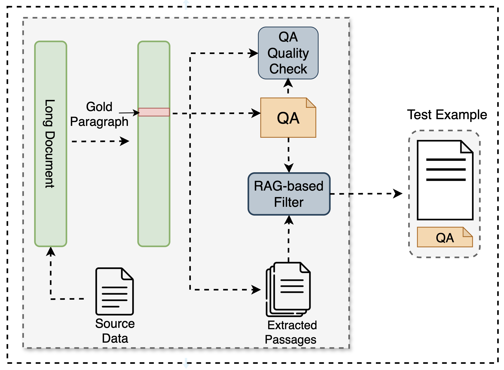

<p align="center">

<h4 align="center">
Automatic, Easy and Realistic tool for LLM Evaluation
</h4>
</p>

<p align="center">
| <a href="https://yale-nlp.github.io/TAIL/"><b>Documentation</b></a> | <a href="https://arxiv.org/abs/2309.06180"><b>Paper</b></a> | 
</p>

<p align="center">

</p>

## Introduction
TAIL is an automatic toolkit for creating realistic evaluation
benchmarks and assessing the performance of long-context LLMs. 
With TAIL, users
can customize the building of a long-context,
document-grounded QA benchmark and obtain
visualized performance metrics of evaluated
models.
## Quickstart 
1. install the package from PyPi:
    ```
    # (Recommended) Create a new conda environment.
    conda create -n tail python=3.10 -y
    conda activate tail

    # Install tailtest
    pip install tailtest
    ```
    set yout OPENAI_API_KEY:
    ```
    export OPENAI_API_KEY="..."
    ```
2. Prepare a source document you want to use to generate benchmark and organize in the format of json.
    `[{"text": "Content of your document"}]`

3. Benchmark Generation:

    ```
    tail-cli.build --raw_document_path "/Users/frank/Desktop/code/TAIL/data/law_10.json" --QA_save_path "/Users/frank/Desktop/code/TAIL/data/QA_law.json" --document_length 8000 16000 32000 48000 64000 80000 96000 112000 128000 --depth_list 5 10 15 20 25 30 35 40 45 50 55 60 65 70 75 80 85 90 95
    ```

4. Model Evaluation & Testing:

    ```
    tail-cli.eval --QA_save_path "/data/QA.json" --test_model_name "gpt-4o" --test_depth_list 25 75 --test_doc_length 8000 32000 --test_result_save_dir /data/result/
    ```

## Citation
